# USB Encryption on MacOS

### Overview

After a trip home for the holidays and a rummage through some old boxes, I am now the proud owner of more than a few USB sticks. I wanted to do something useful with them since I have always loved the idea of having a trove of useful information at your fingertips, and these SSDs ranging from 16gb up to 256gb seemed to be a good way to learn more about drive encryption. 

### Lets Begin Encrypting!

- Start by plugging in your USB (or any external drive for that matter) to your host machine
- Open up Disk Utility by hitting `⌘ + Spacebar` and typing it in, or by finding it under `/Applications/Utilties`

Once in Disk Utlities, we can see our External Drive is showing up on the left hand side highlighted in the red box. From here we can see alot of useful information like the name, size, and partition map. For now, lets ignore these and dive right into formatting the drive. To get started, make sure that nothing valuble is currently saved on the drive. Once ready, click "Erase" in the top right (highlighted in Yellow).

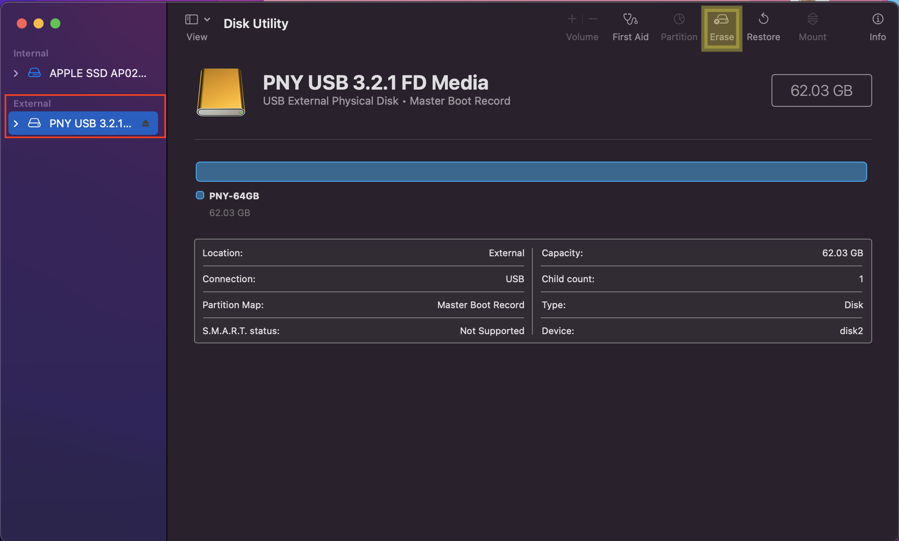

From here, we can see a few different options. Lets start by naming the drive. I will go with "ENCRYPTED" to really get the point across. Once you choose the name, we can then select the format. MacOS offers several different formatting options depending on which version you are running. Let break down some of these options. 

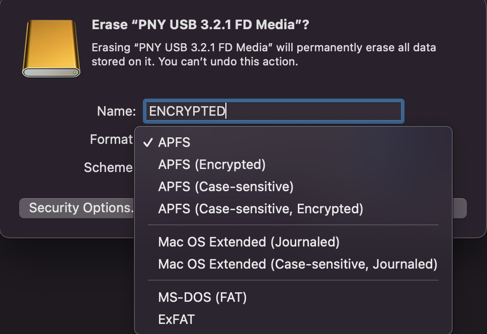

#### MacOS Specifc 

- `APFS`: (Apple File System) This is the default file system used by MacOS version 10.13 or later. This format has several different features (including encryption) and is optimised for SSDs but can also be used with HDD. This option is the basic version of APFS, so we will not choose it for now. 
- `APFS (Encrypted)`: This format is essentially the same as above, but the volume is encrypted. This method uses 128 bit AES encryption.
- `APFS (Case-Sensitive)`: This 'Case-Sentitive' specification indicates that files and folders on the drive will be effected by case sensitivity. for example a file named 'Secret' and 'SECRET' will be two different files. Non Case-Sensitive formats will not make this distinction.
- `APFS (Case-Sensitive, Encrypted)`: This format takes the same `APFS (Case-Sensitive)` format and encrypts it. 

- `Mac OS Extended (Journaled)`: These formats are compatable with MacOS 10.12 or earlier. It uses the Mac format (Journaled HFS Plus) to protect the integrity of the hierarchical file system.
-  `Mac OS Extended (Case-Sensitive, Journaled)`: This format is the same as above, but includes the case sensitivity specification mentioned previously. 

#### Cross Compatablity 

- `MS-DOS (FAT)`: Comaptible with other operating systems, however this format has a 4gb per-file limit and should only be used on drives up to 32gb. 
- `ExFAT`: The exFAT file system was introduced in 2006 and offers better limits on file and partition sizes. This format should be used on any drives larger than 32gb. 

---

### Whats Next

Once we have chosen our format, we can then select our partition scheme.

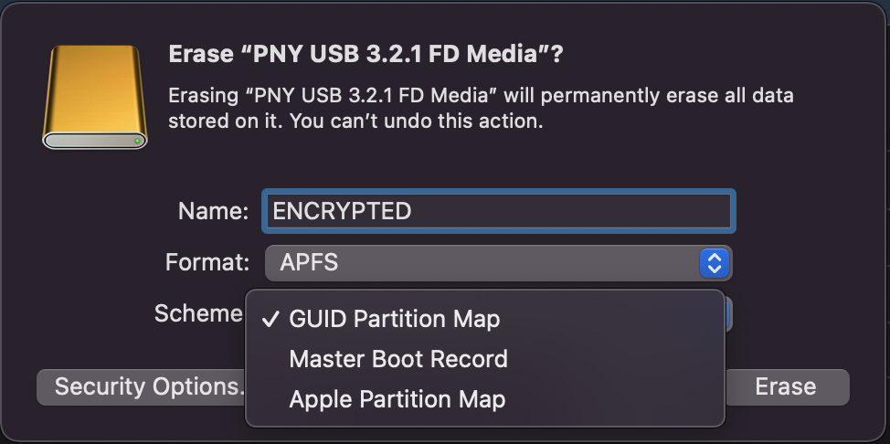

- `GUID Partition Map`:Choose this option for all Intel-based and Apple silicon Mac computers. Some newer Microsoft Windows-based computers can also use this scheme.
- `Master Boot Record`: Choose this option for compatibility with all Microsoft Windows-based computers.
- `Apple Partition Map`: Choose this option for compatibility with old PowerPC-based Mac computers.

### Security Options 

By now, you have likely noticed the 'Security Options' button on the bottom left. If we click in we have a few different options avaliable to us which will determine exactly how securely the drive is erased. 

#### Security Level 1
The first option we see is meant to be the fastest. Not too secure, but fast nonetheless. If this option is used, there may still be remenants of the old drive that was not completely wiped away that could potentially be recovered by certain revovery softwares. 

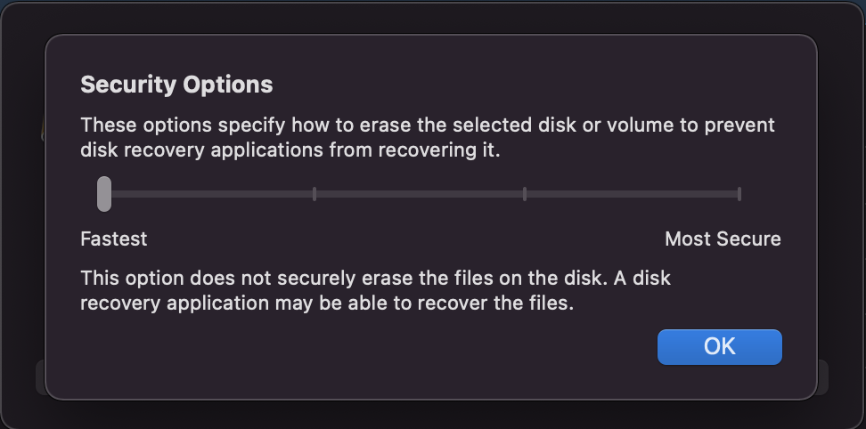

#### Security Level 2
The next most secure option effectively zeroes out the drive. When your computer is erasing the drive, it will write over whatever is there with random data, then turn every binary `1` and `0` it can into a `0`. This will make it much more difficult for recovery software, but with some more sophisticated computing power, this type of wipe is not bulletproof. 

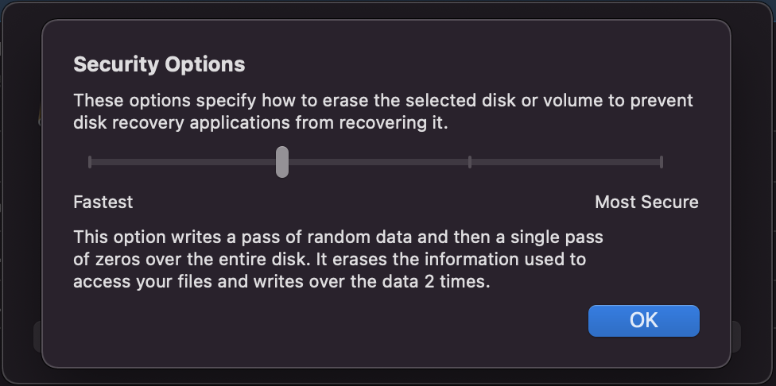

#### Security Level 3
As we move up in security, we start meeting some compliace standards. In this case, this wipe would be DOE-Compliant by wiping and rewriting the disk a total of three times. The Department of Energy has deemed this method secure enough to ensure that their files are irrecoverable, since the 3-pass method effectively destroys (or at least covers up) any original data that may have been stored on the drive, making it exponentially more difficult to recover. 

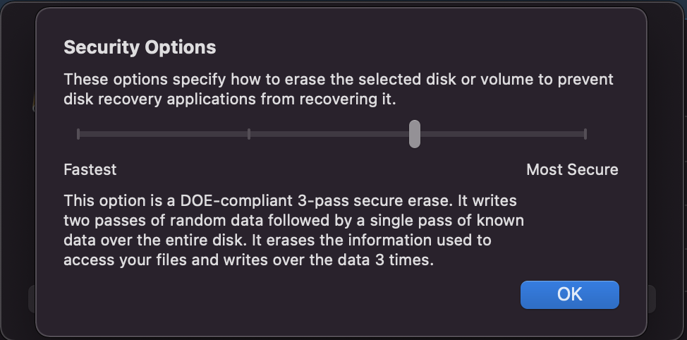

#### Security Level 4
Finally, we arrive at the most secure method MacOS offers. For all intents and purposes, this method is the same as the DOE-Compliant method, but instead of overwriting the drive 3 times, this method will overwrite a total of 7 times. This method is extremely slow and will get slower the larger the drive, however it can be considered extremely secure. Realistically speaking, no one should be able to recover your original data if this method is used. 

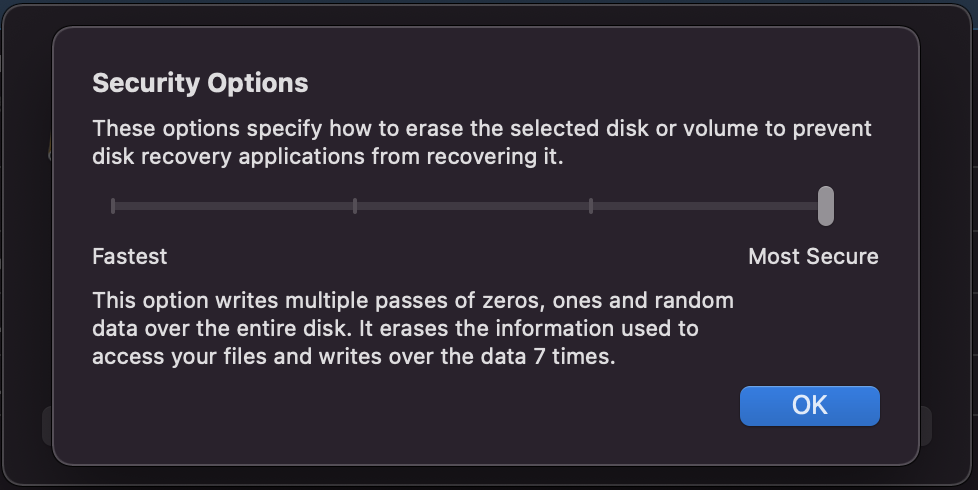

#### Note

The only real way to completely get rid of any data that has been stored on a drive is to completely destroy the drive itself. In the case of extrmely sensitive data, many government organizations will use a combination of these multi-pass overwriting methods as well as degaussing (running a strong enough magnet over the drive to scramble it) and physical destruction. 

### Lets Encrypt

Once we have selected our schema, security options, and encryption format, we will be prompted to enter a password. This will be the password that is used to decrypt the drive when it is plugged back into the computer, so be sure to remember this as it will be the only way to access your data on the drive. 

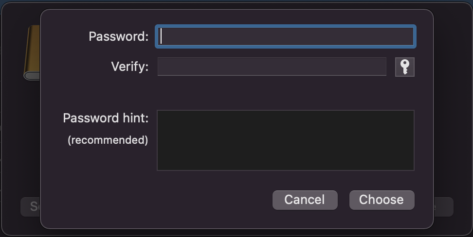

Use a strong password!!

Once you choose your password, and hit 'Erase', your computer will begin wiping the drive and reformatting it. Depending on your security options, this could take a while. 

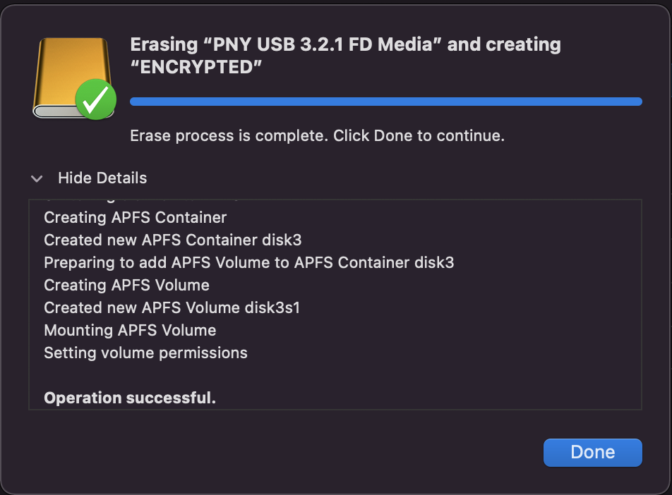

When done, we can now see that our drive has been successfully encrypted! we can double check by looking underneath the name and looking at the format of the drive (highlighted in Yellow).

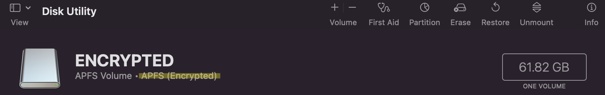

Congratulations you have successfully encrypted a hard drive! Now, any data you put onto the drive will be inaccessible to anyone who does not know the password. This is useful for many reasons as far as protecting sensitive data, however more than anything I believe it goes to show some of the hands-on usecases of encryption. 

Next time you plug the drive into your computer you will be prompted to enter your decryption password before being able to access the contents of the drive. 

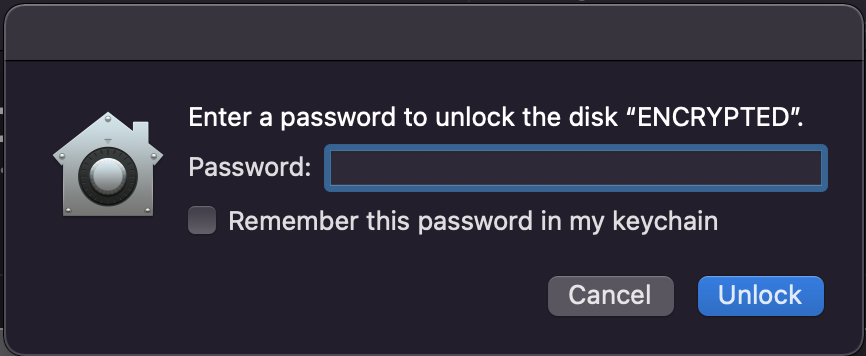

### Conclusion

Encryption is an extremely powerful thing, and until quantum computing forces us to devise better ways of securing our data, the encryption standards that we currently have are extremely secure. Encrypting a drive is a basic application, however encryption is all around us, protecting our most sensitive data from getting into the wrong hands. 

Keep encrypting!

